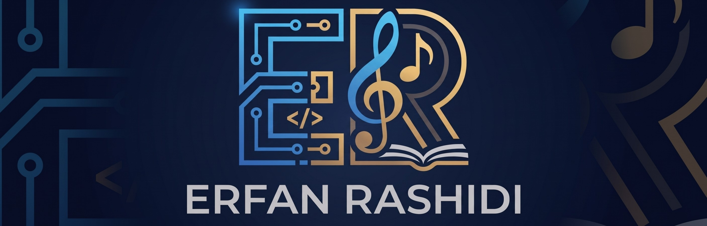

  <h1>🧠 Machine Learning Algorithms Collection</h1>
  
  
<i>A comprehensive and practical guide to implementing Machine Learning algorithms with clear examples.</i>

  

    
    
    
  

---
# author : Erfan Rashidi

## 📖 About the Project

This repository serves as a practical, hands-on path into the world of Machine Learning. It contains clear, well-documented, and easy-to-understand examples of various ML algorithms. Whether you are a beginner looking to grasp the fundamentals or an enthusiast seeking to review core concepts, this collection provides practical Python implementations to help you understand the mechanics behind the models.
